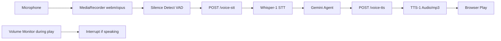

# Aether One

[cloudflarebutton]

A full-stack AI chat application built on Cloudflare Workers. Features persistent multi-session conversations, streaming AI responses powered by Cloudflare AI Gateway (Gemini models), tool calling (web search, weather, MCP integration), and a modern responsive UI with session management.

## ✨ Key Features

- **AI-Powered Chat**: Real-time conversations using Gemini 2.5 Flash/Pro models via Cloudflare AI Gateway
- **Persistent Sessions**: Unlimited chat sessions with automatic titles, activity tracking, and CRUD operations
- **Streaming Responses**: Low-latency streaming for natural chat experience
- **Tool Calling**: Built-in tools for web search (SerpAPI), weather, URL content fetching, and extensible MCP tools
- **Modern UI**: Responsive design with shadcn/ui, Tailwind CSS, dark/light themes, and sidebar navigation
- **Session Management**: List, create, update, delete sessions via API
- **Type-Safe**: Full TypeScript coverage for frontend and Workers backend
- **Production-Ready**: Durable Objects for state, CORS, error handling, health checks

## 🔊 Voice Pipeline (Cloudflare-native)
Uses Workers AI Whisper for STT, Gemini for reasoning, SpeechT5 for TTS via AI Gateway. Real-time barge-in via client VAD. Low-latency HTTP batch processing (~1-2s E2E). Privacy-focused - no third-party STT servers.



## 🛠 Tech Stack

### Frontend
- **React 18** + **TypeScript**
- **Tailwind CSS** + **shadcn/ui** + **Headless UI**
- **TanStack Query** + **Zustand** (state management)
- **React Router** + **Framer Motion** (animations)
- **Lucide React** (icons) + **Sonner** (toasts)

### Backend
- **Cloudflare Workers** + **Hono** (routing)
- **Durable Objects** (chat agents + session controller)
- **Cloudflare Agents SDK** (multi-agent architecture)
- **OpenAI SDK** (AI completions + tools)
- **Model Context Protocol (MCP)** (extensible tools)

### Deployment & DevOps
- **Cloudflare Pages** (static assets)
- **Cloudflare Workers** (serverless API)
- **Wrangler** (CLI)
- **Bun** (fast bundler/package manager)
- **Vite** (build tool)

## 🚀 Quick Start

### Prerequisites
- [Bun](https://bun.sh/) installed (`curl -fsSL https://bun.sh/install | bash`)
- [Cloudflare Account](https://dash.cloudflare.com/) with Workers enabled
- Cloudflare API Token with `Account Workers:Edit`, `Workers Scripts:Edit`
- [Cloudflare AI Gateway](https://developers.cloudflare.com/ai-gateway/) configured (get `CF_AI_BASE_URL` and `CF_AI_API_KEY`)
- Optional: [SerpAPI key](https://serpapi.com/) for web search (`SERPAPI_KEY`)

### Installation
```bash
bun install
```

### Configure Secrets
```bash
wrangler secret put CF_AI_API_KEY
wrangler secret put SERPAPI_KEY          # Optional, for web search
wrangler secret put OPENROUTER_API_KEY   # Optional, if using OpenRouter
```

Update `wrangler.jsonc` with your `CF_AI_BASE_URL` (e.g., `https://gateway.ai.cloudflare.com/v1/{account_id}/{gateway}/openai`).

### Development
```bash
bun dev
```
Opens at `http://localhost:8787` (frontend + API).

### Production Build
```bash
bun build
```

## 📖 Usage

1. **Voice Mode**: Click microphone icon → speak naturally → hear AI responses with barge-in interruption support
2. **Text Chat**: Type messages in input box (shares same session context as voice)
3. **Start Chatting**: Send messages via the UI – supports streaming and model switching
4. **Manage Sessions**: Create new chats, switch sessions, rename/delete via sidebar
5. **Voice Controls**: Mic on/off, speaker mute, VAD sensitivity slider (Settings)
6. **Tools**: Ask about weather (`get_weather`), search web (`web_search`), or use MCP tools
7. **API Endpoints**:
   - `POST /api/sessions` – Create session
   - `GET /api/sessions` – List sessions
   - `POST /api/chat/:sessionId/chat` – Send message
   - `GET /api/chat/:sessionId/messages` – Get chat state
   - `POST /api/voice-stt` – Speech-to-text endpoint
   - `POST /api/voice-tts` – Text-to-speech endpoint

Example chat:
```
User: What's the weather in London?
AI: 🌤️ Weather in London: 22°C, Sunny (via get_weather tool)
```

## ☁️ Deployment

Deploy to Cloudflare in one command:

```bash
bun deploy
```

Or use the [Deploy to Cloudflare](https://deploy.workers.cloudflare.com) button:

[cloudflarebutton]

This deploys both Workers (API + Durable Objects) and Pages (frontend).

**Post-Deployment**:
1. Run `wrangler types` (generates `worker-configuration.d.ts`)
2. Set production secrets via Wrangler or Dashboard
3. Custom domain: Update Pages project settings

## 🔧 Configuration

- **AI Models**: Edit `MODELS` in `src/lib/chat.ts`
- **Tools**: Extend in `worker/tools.ts` or add MCP servers in `worker/mcp-client.ts`
- **UI Customization**: Modify `src/pages/HomePage.tsx`, `tailwind.config.js`
- **Routes**: Add custom API routes in `worker/userRoutes.ts`

Environment Variables:
| Variable | Required | Purpose |
|----------|----------|---------|
| `CF_AI_BASE_URL` | Yes | AI Gateway endpoint |
| `CF_AI_API_KEY` | Yes | AI Gateway token |
| `SERPAPI_KEY` | No | Web search |
| `OPENROUTER_API_KEY` | No | Alternative models |

## 🤝 Contributing

1. Fork & clone
2. `bun install`
3. `bun dev`
4. Create feature branch: `git checkout -b feature/my-feature`
5. Commit: `git commit -m "feat: add my feature"`
6. Push & PR

## 📄 License

MIT License. See [LICENSE](LICENSE) for details.

---

⭐ **Star on GitHub** · 💬 **Join Discussions** · 🐛 **Report Bugs**